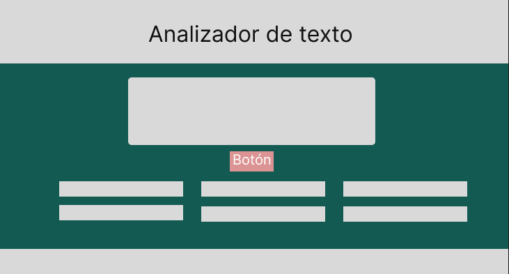
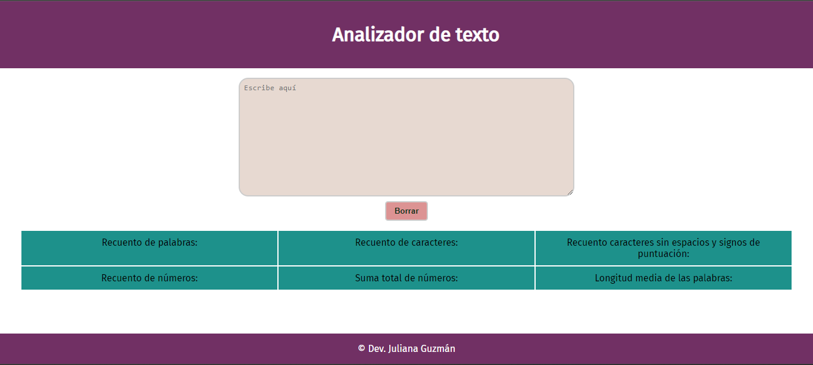

# Analizador de texto

## Resumen del proyecto

Es una herramienta web, qué permite al usuario visualizar ciertas metricas de un texto en particular. Las ventajas de este analizador es que puedes ingresar un texto determinado ó ir contruyendolo con las mediciones en tiempo real.

## Funcionalidades

Con el analizador de texto puedes revisar elementos cómo:

  - **Recuento de palabras**: muestra el recuento de palabras ingresadas.
  - **Recuento de caracteres**: cuenta cuantos caracteres hay en total.
  - **Recuento de caracteres excluyendo espacios y signos de puntuación**: muestra el recuento de caracteres excluyendo espacios y signos de puntuación
  - **Recuento de números**: permite conocer cuantos numeros hay en el texto.
  - **Suma total de números**: muestra la suma total entre los números ingresados en el texto.
  - **Longitud media de las palabras**: permite observar la longitud media de las palabras ingresadas.

## Diseño y prototipo
  
El analizador de texto, parte de un prototipo de baja fidelidad, el cual, se creó con la herramienta `Figma`. Con él, inicia la estructura básica que se crea a partir del `HTML`, entender las funcionalidades que debe tener el programa por medio de `JS` y finalmente ayuda a pensar en el diseño visual por medio del `CSS`.

Finalmente el proyecto se muestra de la siguiente manera:

